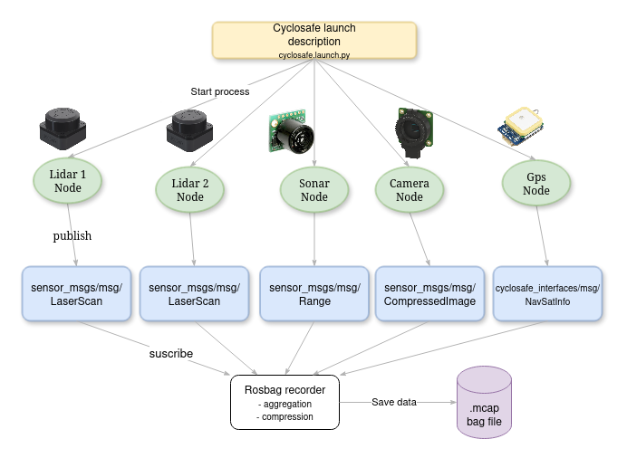

# Résumé

A chaque capteur est associé un noeud ROS qui implémente éventuellement un driver et publie les mesures sur des topics dédiés.

Chaque noeud peut-être lancé indépendemment ou l'ensemble des noeuds sont lancés ensembles via la launch description [**cyclosafe.launch.py**](src/cyclosafe/README.md#launch-description)

- [Résumé](#résumé)
- [Schémas](#schémas)
	- [Schéma simplifié](#schéma-simplifié)
	- [Modèle UML complet](#modèle-uml-complet)
- [Structure](#structure)
	- [cyclosafe](#cyclosafe)
	- [cyclosafe\_config](#cyclosafe_config)
	- [cyclosafe\_interfaces](#cyclosafe_interfaces)
	- [cyclosafe\_lidar](#cyclosafe_lidar)
	- [rplidar\_ros2](#rplidar_ros2)

# Schémas

## Schéma simplifié

## Modèle UML complet

# Structure

## cyclosafe

[**src/cyclosafe/README.md**](src/cyclosafe/README.md)

Noeud central du projet.

Contient :
- l'ensemble des noeuds de capteur écrits en python, à savoir :
	- [**noeud gps**](src/cyclosafe/README.md#gpspy) publiant des *cyclosafe_interfaces/msg/NavSatInfo*
	- 4 noeuds pour différents sonars  publiant des *sensor_msgs/msg/Range*
		- [**sonar**](src/cyclosafe/README.md#sonarpy) pour la gamme MaxBotix USB
		- [**sonar_sr04**](src/cyclosafe/README.md#sonar_sr04py) pour le modèle SR04
		- [**sonar_lv_pw**](src/cyclosafe/README.md#sonar_lv_pwpy-obsolete) pour la gamme MaxBotix en mesurant la largeur des pulse (PWM)
		- [**sonar_rs232**](src/cyclosafe/README.md#sonar_rs232py) pour la gamme MaxBotix LV10X0
	- [**tof_lidar**](src/cyclosafe/README.md#tof_lidarpy) pour le lidar unidirectionnel de Waveshare publiant des *sensor_msgs/msg/Range*
	- [**noeud caméra**](src/cyclosafe/README.md#camera_pipy) publiant des *sensor_msgs/msg/CompressedImage* sur le topic ***
- l'implémentation de classes utilisées par des noeuds ou d'autres packages :
	- [**ASerialSensor**](src/cyclosafe/README.md#aserialsensor) : modèle de noeud générique parsant des données envoyées via serial
	- [**ACamera**](src/cyclosafe/README.md#acamera) : modèle de noeud caméra0
- la [**launch description**](src/cyclosafe/README.md#launch-description) permettant de lancer l'ensemble des noeuds ensembles.

## cyclosafe_config

[**src/cyclosafe_config/README.md**](src/cyclosafe_config/README.md)

Package python dont la seule fonction est d'exporter les classes `Sensor` et `SensorTypeEnum`, utiles à l'intégration d'un node dans une launch description, en permettant d'uniformiser la déclaration des paramètres à travers plusieurs launch description.

Ces classes sont également utilisées par l'environnement [**viewer/**](../viewer/README.md), raison pour laquelle elles sont isolées dans un package.

## cyclosafe_interfaces

Définit les interfaces ROS 2 propres au projet, à savoir :
- ***cyclosafe_interfaces/msg/NavSatinfo*** : extension de sensor_msgs/msg/NavSatFix intégrant des données supplémentaires comme l'altitude, la vitesse, le nombre de satellites utilisées et la dop.
- ***cyclosafe_interfaces/srv/SaveImages (obsolete)*** : service permettant l'interaction entre le noeud hub (supprimé) et le noeud caméra. Demande au noeud caméra d'enregistrer les images prises sur les X dernières secondes.

[**src/cyclosafe_interfaces/README.md**](src/cyclosafe_interfaces/README.md)

## cyclosafe_lidar

[**src/cyclosafe_lidar/README.md**](src/cyclosafe_lidar/README.md)

Package cpp qui permet d'intégrer les lidars de la gamme Benewake à ROS2. Implémente un driver via l'interface sériale et un noeud pour publier les données sous forme de sensor_msgs/msg/Range.

## rplidar_ros2

[**src/rplidar_ros2/README.md**](src/rplidar_ros2/README.md)

Clone de https://github.com/CreedyNZ/rplidar_ros2

Implémente le driver du lidar rplidar-c1 et l'intègre à ROS2.
