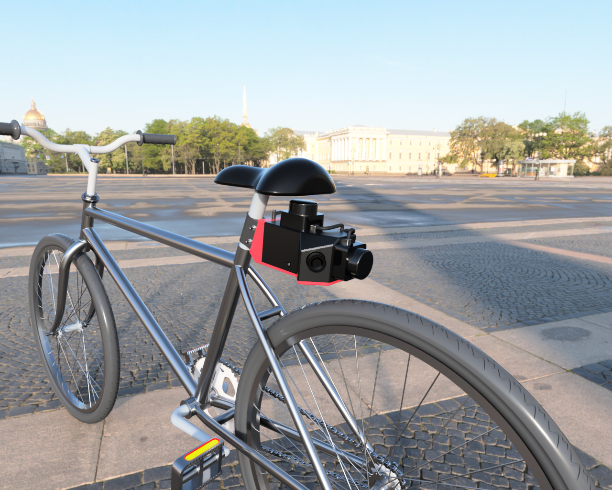
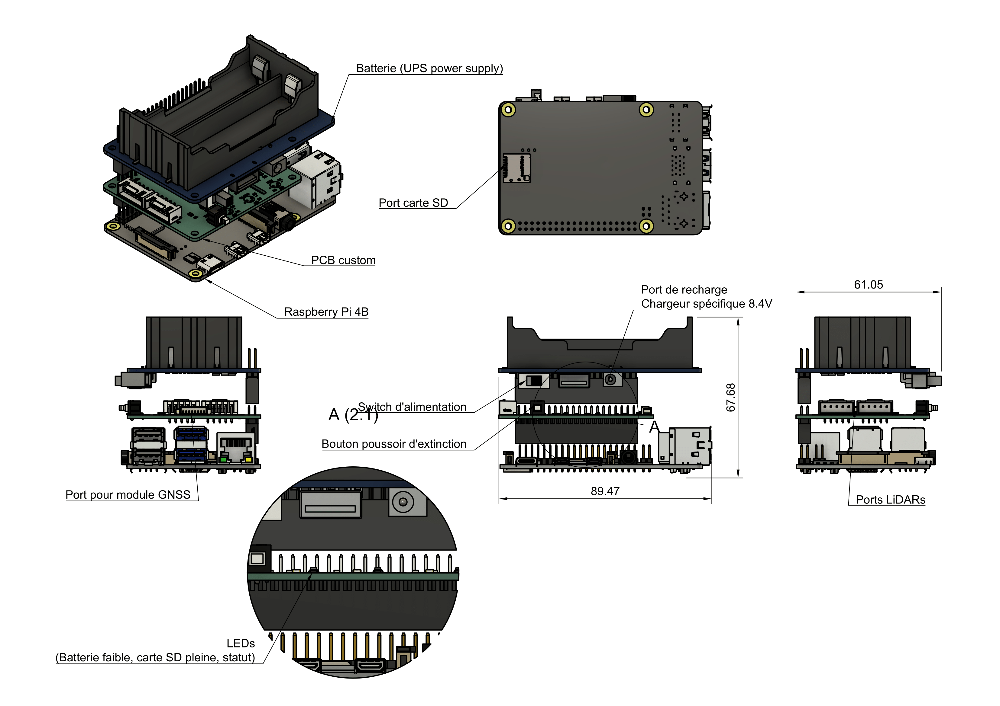
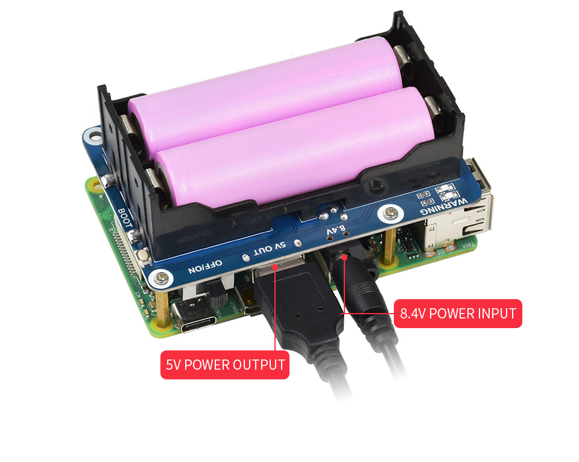
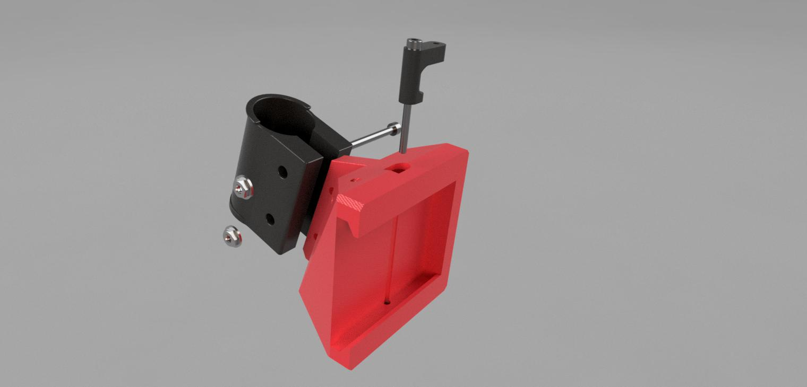
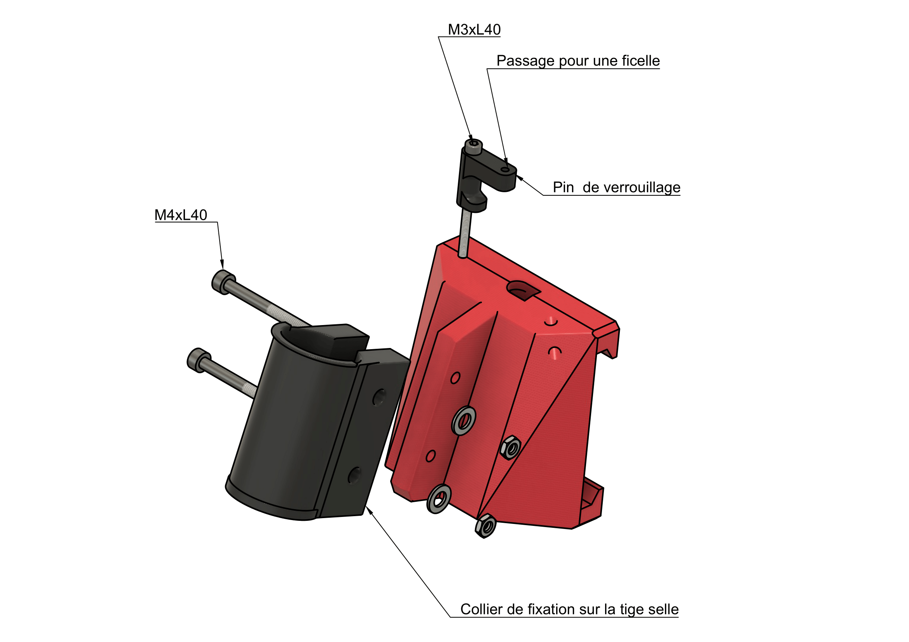
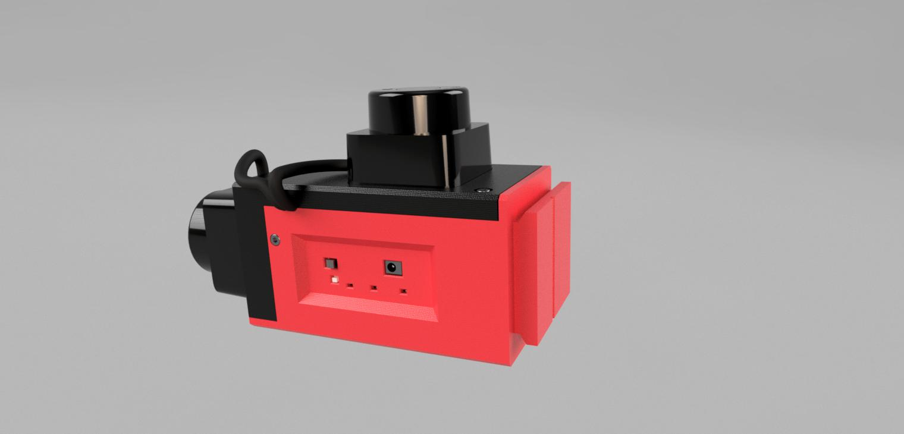
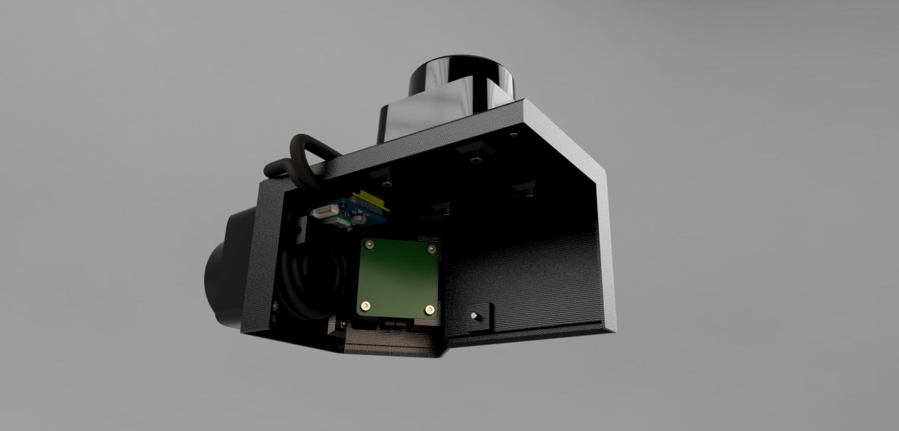
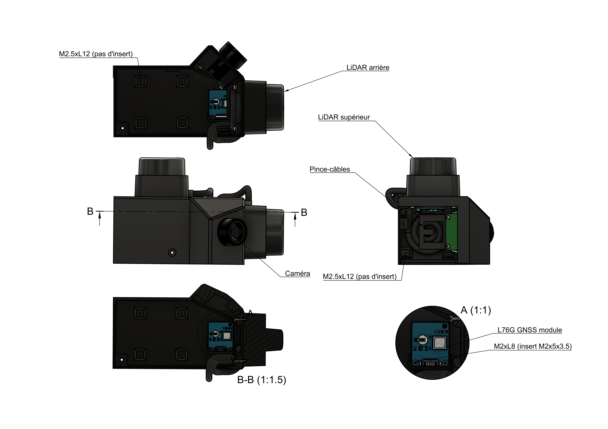
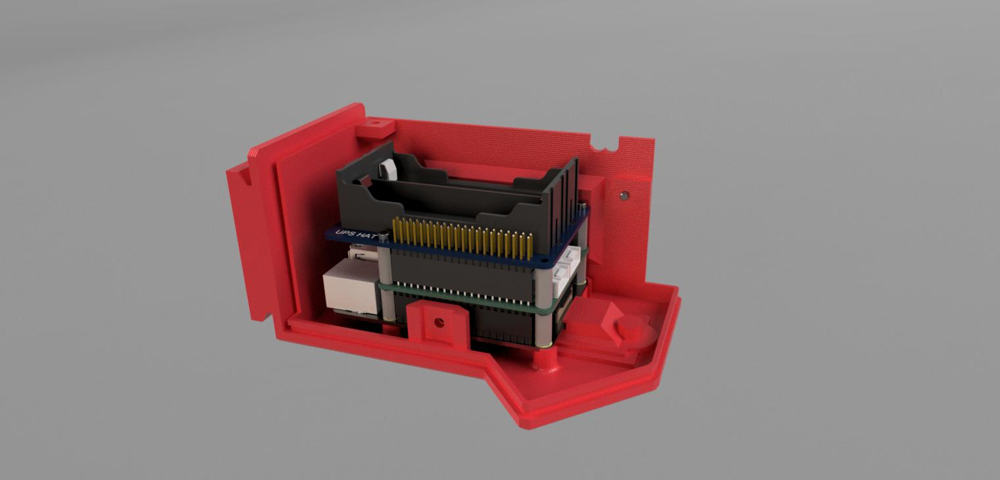
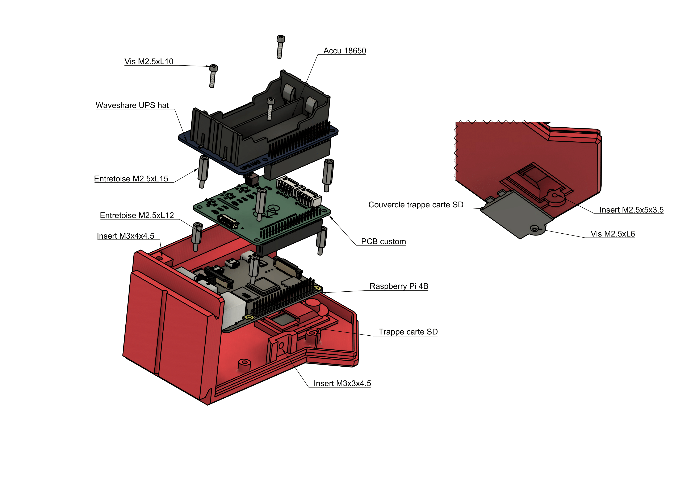

# Cyclosafe design

Ce dossier contient les fichiers relatifs à la fabrication du boitier destiné à recevoir tous les composants ainsi que les fichiers de fabrication du PCB dédié.

- [Cyclosafe design](#cyclosafe-design)
- [Liste du matériel (BOM)](#liste-du-matériel-bom)
	- [COMPOSANTS](#composants)
	- [Quincaillerie](#quincaillerie)
	- [Inserts](#inserts)
- [Electronique](#electronique)
	- [Montage complet](#montage-complet)
	- [PCB dédié](#pcb-dédié)
		- [Fonctions](#fonctions)
		- [Schéma](#schéma)
		- [Aperçu](#aperçu)
- [Boitier imprimé en 3D](#boitier-imprimé-en-3d)
	- [Module waveshare UPS hat](#module-waveshare-ups-hat)
		- [Spécifications](#spécifications)
		- [Aperçu](#aperçu-1)
- [Fixation au vélo](#fixation-au-vélo)
- [Module de mesure amovible](#module-de-mesure-amovible)
	- [Partie haute](#partie-haute)
	- [Partie basse](#partie-basse)

---

# Liste du matériel (BOM)

## COMPOSANTS

| Quantité | Nom de la pièce | Fonction | Masse (g) | Type | Origine |
|----------|-----------------|----------|-----------|------|---------|
| 1 | Raspberry Pi 4 Model B | Firmware | 75.00 | PCB | Achat |
| 1 | UPS-HAT | Batterie | 120.00 | PCB | Achat |
| 1 | PCB custom | Électronique | 30.00 | PCB | Fabrication par un tiers |
| 1 | Raspberry Pi HQ Camera | Capteur | 30.40 | Capteur | Achat |
| 1 | Objectif CS-8 25mm | Capteur | 40.00 | Accessoire | Achat |
| 2 | Slamtec RPLiDAR C1 | Capteur | 110.00 | Capteur | Achat |
| 1 | Assemblage F | Fixation | 90.00 | Structure | Impression |
| 1 | Collier | Fixation | 37.00 | Structure | Impression |
| 1 | L76x GPS Module | Capteur | 5.00 | PCB | Achat |
| 1 | Boîtier bas | Structure | 130.00 | Structure | Impression |
| 1 | Boîtier haut | Structure | 101.00 | Structure | Impression |
| 1 | Carte SD | Firmware | 2.00 | Accessoire | Achat |
| 2 | Accu 18650 - 3400mAh | Batterie | 46.00 | Accessoire | Achat |
| 1 | Couvercle carte SD | Structure | 3.30 | Structure | Impression |
| 1 | Ficelle pour pin de verrouillage (diamètre < 2mm) | Fixation | 1.00 | Accessoire | Achat |
| 1 | Pin de verrouillage | Fixation | 1.65 | Structure | Impression |

## Quincaillerie

| Quantité | Nom de la pièce | Fonction | Masse (g) | Type | Origine |
|----------|-----------------|----------|-----------|------|---------|
| 1 | Vis à tête hexagonale M2.5x6 | Trappe carte SD | 0.487 | Quincaillerie | Achat |
| 4 | Entretoise M/F M2.5x12 | Entretoise Raspberry | 1.999 | Quincaillerie | Achat |
| 4 | Entretoise M/F M2.5x15 | Entretoise HAT | 2.393 | Quincaillerie | Achat |
| 8 | Vis à tête hexagonale M2.5x12 | Lidars | 0.702 | Quincaillerie | Achat |
| 2 | Vis à tête hexagonale M2x8 | GPS | 0.341 | Quincaillerie | Achat |
| 3 | Vis à tête hexagonale M3x6 | Boîtiers | 0.796 | Quincaillerie | Achat |
| 8 | Vis à tête hexagonale M2.5x10 | UPS HAT & caméra | 0.630 | Quincaillerie | Achat |
| 1 | Vis à tête hexagonale M3x0.5x40 | Axe centrale du pin de blocage | 2.569 | Quincaillerie | Achat |
| 2 | Vis à tête hexagonale M4x0.7x40 | Collier | 4.776 | Quincaillerie | Achat |

## Inserts

| Quantité | Nom de la pièce | Fonction | Masse (g) | Type | Origine |
|----------|-----------------|----------|-----------|------|---------|
| 2 | Insert M4x8x6 | Collier | 2.00 | Quincaillerie | Achat |
| 1 | Insert M3x4x4.5 | Emboîtement supérieur | 1.00 | Quincaillerie | Achat |
| 2 | Insert M3x3x4.5 | Emboîtement latéral | 1.00 | Quincaillerie | Achat |
| 4 | Insert M2.5x4x3.5 | Raspberry | 1.00 | Quincaillerie | Achat |
| 2 | Insert M2x5x3.5 | GPS | 1.00 | Quincaillerie | Achat |
| 5 | Insert M2.5x5x3.5 | Couvercle SD + caméra | 1.00 | Quincaillerie | Achat |

# Electronique

Le coeur du boitier comporte un assemblage de 3 circuits imprimés emboités les uns par desus les autres :
- un rapbeerry Pi 4B sur lequel vient se brancher la caméra
- un PCB personnalisé sur lequel vient se brancher les capteurs (2 LiDARS + un module GNSS)
- un module UPS (*Uninterruptible Power Supply*) alimentés par deux accus 18650 permettant de fournir le courant nécessaire (jusqu'à 3A), de protéger le circuit et de gérer la recharge

## Montage complet

## PCB dédié

 ### Fonctions
- permet de connecter les capteurs aux différentes interfaces UARTs du raspberry :
  - UART1 : LiDAR 1 (supérieur)
  - UART2 : LiDAR 2 (arrière)
  - UART5 : module GNSS
- intègre 3 LEDs pour avertir l'utilisateur des situations suivantes :
  - batterie faible (< 20 %) : voyant rouge allumé
  - carte sd pleine : voyant bleu allumé
  - démarrage/arrêt en cours : voyant jaune allumé sans clignotement
  - mesure en cours : voyant jaune clignotant
- intègre un bouton poussoir permettant de déclencher l'arrêt des mesures et d'éteindre en douceur le raspberry

### Schéma

### Aperçu

# Boitier imprimé en 3D

Le dossier [`kicad/`](kicad/) contient le projet Kicad 9.0 d'un PCB sur lequel viennent se brancher les différents capteurs et composants actifs (LEDs et bouton d'extinction).

Il prend la forme d'un hat pour raspberry et se connecte via le header de 40 pins.

## Module waveshare UPS hat

Il s'agit d'une alimentation non interruptible commercialisée par Waveshare.

### Spécifications

- alimenté par 2 accus 18650
- permet une utilisation constante du raspberry via batterie ou pendant la recharge sur secteur
- protection contre les court-circuits, polarité inversée, surcharge/décharge des batterie
- jusqu'à 2.5A en 5V
- monitoring de la tension des batteries (permettant de calculer le pourcentage restant) et de la consommation instantanée

### Aperçu

# Fixation au vélo

Cette partie là demeure sur la tige selle.

Un collier facilement déformable est placé autour de la tige selle et vient verrouiller l'assemblage femelle avec deux vis M4.

Le design du  collier est basé sur  par [**<ins>un modèle réalisé par Metamere</ins>**](https://www.printables.com/model/125810-bens-better-dropper-post-seat-bag-adapters-264-22-)  trouvé sur *printables.com* et distribué sous licence Creative Commons.

Il a été allongé, épaissi et simplifié par rapport au modèle original.

Le sytème de fixation est inspiré de celui du projet Open Source [**<ins>Open bike sensor</ins>**](https://github.com/openbikesensor/OpenBikeSensor3dPrintableCase), en particulier le système de glissière entre le support fixe demeurant sur la tige selle et le boitier principal.

# Module de mesure amovible

Il vient se glisseer dans l'assemblage femelle fixé sur la tige selle.

Le pin de verrouillage de la fixation s'insère dans un des trous prévus à cet effet et peut tourner sur lui-même afin de maintenir l'assemblage en place (un de chaque côté selon la place disponible sous ou au dessus du boitier).

Il se compose d'une partie basse et d'une partie haute qui viennent se clipser ensemble. 3 vis M3 permettent de verrouiller l'assemblage des deux boitiers.

## Partie haute

## Partie basse

