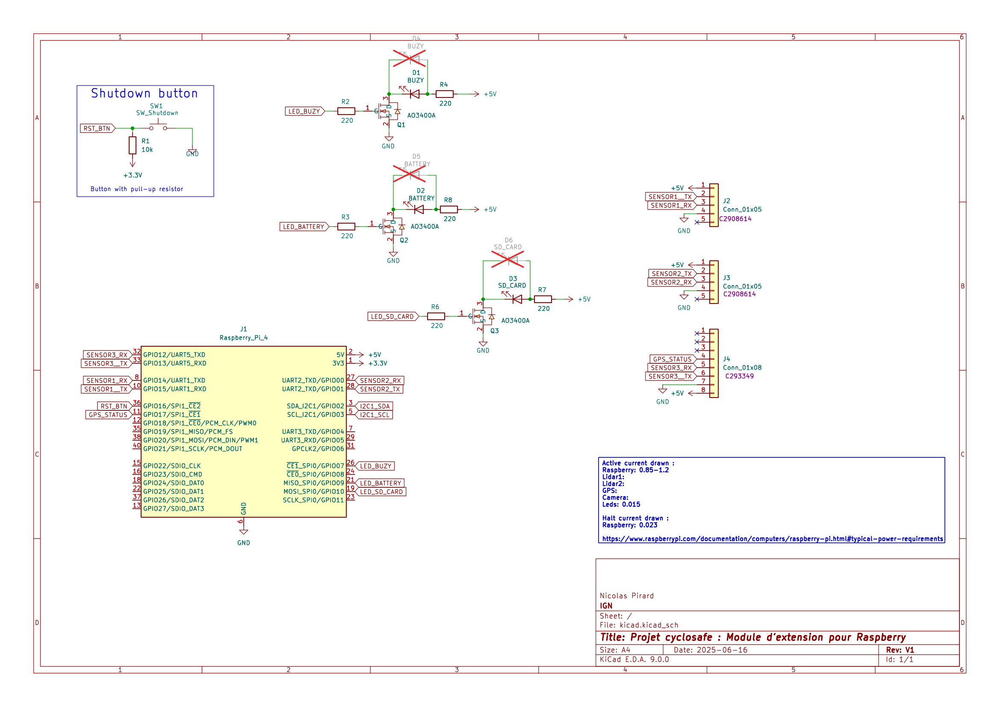
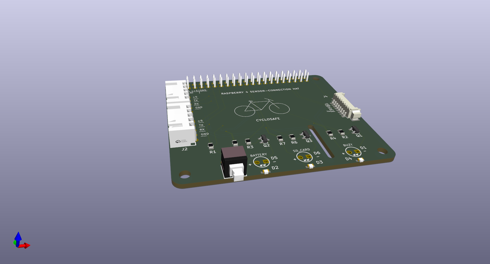

# Cyclosafe design

Contient les fichiers relatifs à la fabrication du boitier destiné à recevoir tous les composants ainsi que les fichiers de fabrication du PCB dédié.

# Liste du matériel (BOM)

# Electronique

# Boitier imprimé en 3D

## PCB dédié

Le dossier [`kicad/`](kicad/) contient le projet Kicad 9.0 d'un PCB sur lequel viennent se brancher les différents capteurs et composants actifs (LEDs et bouton d'extinction).

Il prend la forme d'un hat pour raspberry et vient se connecter via le header de 40 pins.

