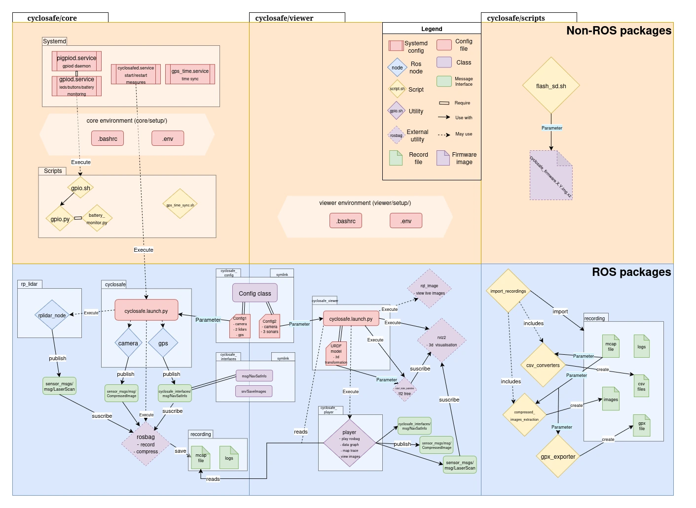

Contient des scripts et utilitaires destinés à faciliter la récupération des données.

- [sd\_flash.sh](#sd_flashsh)
  - [Usage](#usage)
  - [Personnaliser l'environnement et les paramètres de mesure](#personnaliser-lenvironnement-et-les-paramètres-de-mesure)
- [import\_recordings.py](#import_recordingspy)
  - [Dépendance](#dépendance)
  - [Usage](#usage-1)
  - [Exemple](#exemple)
    - [Exporter en lisant directement la carte SD](#exporter-en-lisant-directement-la-carte-sd)
    - [Exporter en SSH](#exporter-en-ssh)
    - [Pour convertir/réparer seulement les données (avec des données déjà importées)](#pour-convertirréparer-seulement-les-données-avec-des-données-déjà-importées)
  - [Paramètres](#paramètres)
  - [Procédure normale](#procédure-normale)
  - [Paramètres](#paramètres-1)
- [Diagramme UML du projet (section cyclosafe/scripts)](#diagramme-uml-du-projet-section-cyclosafescripts)

# sd_flash.sh

Script interactif automatisant le flash du firmware cyclosafe vers une carte SD.
- Décompresse l'image tout en la flashant
- Calcul de la taille restante disponible sur la carte SD et estime le nombre d'heure d'enregistrement correspondant
- Ejecte la carte SD

## Usage

~~~
# Remplacer /dev/sdX par le device auquel correspond la carte SD
sudo ./sd_flash.sh ./cyclosafe_firmware.img.xz /dev/sdX
~~~

## Personnaliser l'environnement et les paramètres de mesure

Une fois la carte SD flashée et montée (généralement `/media/$HOME/rootfs`), le fichier `/media/$HOME/rootfs/home/cycliste/cyclosafe/core/setup/.env` peut être modifié pour configuré [les différentes variables d'environnement](../core/setup/README.md#env).

Les [paramètres des noeuds ROS](../core/src/cyclosafe/README.md#cyclosafe-package) tels que la fréquence de la caméra et sa résolution peuvent être configurés dans `/media/$HOME/rootfs/home/cycliste/cyclosafe/core/src/cyclosafe/launch/config.py`.

# import_recordings.py

Utilitaire permettant :
- d'exporter l'ensemble des enregistrement d'un raspberry via ssh
- de décompresser les bags et de les convertir en fichiers uniques
- de réparer les éventuels enregistrements corrompus

Il est nécessaire de préciser l'une des deux options d'import (**-u** en ssh ou **-c** pour une copie).

## Dépendance

Ce script a besoin pour fonctionner d'être lancé dans un environnement ou ROS2 est installé et sourcé.
Il est donc fortement recommandé de suivre les instructions d'installation [de ROS2 et de l'environnement cyclosafe](../viewer/README.md#installation).

En complément le script de conversion de CSV nécessite quelques dépendances en plus :
~~~
pip install mcap mcap-ros2-support --break-system-packages
~~~

## Usage

~~~
$ ./import_recordings.py --help
usage: import_recordings.py [-h] [-u HOSTNAME] [-c COPY] [-s SKIP_IMPORT] [-o OUTPUT] [-x]

Import, decompress and merge rosbag files from a remote host to single bag file. Attemmpt to repair corrupted bags.

options:
  -h, --help            show this help message and exit
  -u HOSTNAME, --hostname HOSTNAME
                        Hostname for SSH connection (user@host-ip)
  -c COPY, --copy COPY  Path to a local source directory (e.g., mounted SD card) to copy from
  -s SKIP_IMPORT, --skip_import SKIP_IMPORT
                        Skip import step and use specified local path for conversion
  -o OUTPUT, --output OUTPUT
                        Output directory for imported bags
  -x, --clean           Delete bag/ directories locally after successful import and conversion

~~~

## Exemple

### Exporter en lisant directement la carte SD

~~~
./import_recordings.py -x -c /dev/media/sda1/home/cycliste/data/ -o ~/data/test/
~~~

- `-x` : nettoie les fichiers de transition après la fin de chaque conversion afin de minimiser l'espace occupé sur l'hôte
- `-c /dev/media/sda1/home/cycliste/data/` : importer les bags depuis le chemin donné sur la carte SD.
- `-o ~/data/test/` : exporte les enregistrements vers le dossier de sortie `~/data/test/` 

### Exporter en SSH

~~~
./import_recordings.py -x -u cycliste@192.168.2.2 -o ~/data/test/
~~~

- `-x` : nettoie les fichiers de transition après la fin de chaque conversion afin de minimiser l'espace occupé sur l'hôte
- `-u cycliste@192.168.2.2` : importer les bags depuis un raspberry connecté sur le réseau avec comme profil utilisateur `cycliste` et ayant pour ip `192.168.2.2`. Le mot de passe utilisateur sera demandé (`galileo`)
- `-o ~/data/test/` : exporte les enregistrements vers le dossier de sortie `~/data/test/` 

**Résultat** :
~~~
           INFO     Output directory: /home/cycliste/data/test                 
Enter SSH password: 
           INFO     Retrieving record list from cycliste@192.168.2.2...         
           INFO     Found 9 record directories.                                
           INFO     [1/9] Importing 20250515-125430 to /home/user/data/test...
           INFO     Running: sshpass -p XXXX scp -r                        
                    cycliste@192.168.2.2:/home/cycliste/data/20250515-125430                                            
                    /home/user/data/test/        
...
INFO     [2/8] Converting bags in 20250515-125326...                       
           WARNING  /home/cycliste/data/user/20250515-125326 is missing a metadata.yaml
Attempting to repair /home/cycliste/data/user/20250515-125326/bag
           INFO     Running: unzstd
                    /home/cycliste/data/user/20250515-125326/bag/bag_0.mcap.zstd
           INFO     Successfully uncompressed bag
           INFO     Running: ros2 bag reindex .
...
           INFO     All operations completed successfully! 
~~~

### Pour convertir/réparer seulement les données (avec des données déjà importées)

Suppose que les données ont déjà été importées sur l'hôte (manuellement) mais que la conversion/décompression n'a pas été faite.

~~~
./import_recordings.py -s ~/data/test/
~~~

- `-s ~/data/test/` : spécifie le chemin où sont stockées les enregistrements.

**Résultat :**

~~~
INFO     Output directory: /home/cycliste/data/pouet                                import_recordi:246
           INFO     Found 8 record directories in /home/user/data/test
           INFO     [1/8] Converting bags in 20250516-175032...
           INFO     Converted bag already exist in /home/user/data/test/20250516-175032,
                    skipping...                                
...
           INFO     All operations completed successfully!
~~~

## Paramètres

> **-u (--hostname)**
> 	- **optionnel**
> 	- adresse ssh au format **user@ip** du raspberry à joindre
> 	- le répertoire à partir duquel importer les enregistrement sera **user@ip:/home/user/data/**

> **-c (--copy)**
> 	- **optionnel**
> 	- chemin local à partir duquel les enregistrements
> 	- **Ex:** /media/sdcard0/home/user/data

> **-o (--output-path)**
> 	- **optionnel**
> 	- **par défaut** : ~/data/import
> 	- chemin auquel importer les données sur l'host

> **-s (--skip-import)**
> 	- **optionnel**
> 	- Ignore la phase d'import
> 	- Convertit seulement les données en réparant les éventuelles corruptions

> **-c (--clean)**
> 	- **optionnel**
> 	- **par défaut** : false
> 	- Supprime le dossier bag/ des enregistrements importés afin de réduire l'espace occupés sur l'hôte

## Procédure normale

1. les enregistrements sont importés tels quel (en gardant leur strucutre) dans le dossier précisé par l'option **-o** (ou **~/data/import** si non précisé).

	Cela peut-être fait via ssh avec l'option **-u** ou par copie depuis une carte sd avec l'option **-c**.
	
	La structure d'un enregistrement importé est la suivante :
	~~~
	$ tree ~/data/
	/home/user/data/
	└── 20250515-125326 # Date de l'enregistrement
		├── bag # Dossier contenant les fichiers créés par rosbag
		│   ├── bag_0.mcap.zstd
		│   ├── bag_1.mcap.zstd
		│   └── metadata.yaml
		└── logs # Un fichier log pour chaque noeud
		    ├── ldlidar_stl_ros2_node_1008_1747313607000.log
		    ├── node_lidar_1087_1747313611560.log
		    ├── python3_1002_1747313608450.log
		    ├── python3_1004_1747313613884.log
		    ├── python3_1006_1747313608700.log
		    └── rplidar_node_1010_1747313607000.log
	~~~
2. pour chaque enregistrement, les bags morcelés en plusieurs fichiers sont réunis en un seul fichier non compressé au format **.mcap** dans un nouveau sous-dossier **out/**.

   Les bags compressés sont décompressés au passage.

   Cela est fait via la commande suivante :
   ~~~
   ros2 bag convert -i /home/user/data/20250515-125326/bag -o /home/user/data/20250515-125326/out/out_options
   ~~~

   Le fichier **out_options** dont il est question défini les paramètres de sortie de la conversion, notamment le nom de sortie du bag converti.

   Voici son contenu :
   ~~~
   output_bags:
   - uri: ./out/  # required
     storage_id: ""  # will use the default storage plugin, if unspecified
     max_bagfile_size: 0
     max_bagfile_duration: 0
     storage_preset_profile: ""
     storage_config_uri: ""
     # optional filter for msg time t [nsec since epoch]:  start_time_ns <= t <= end_time_ns
     # start_time_ns: 1744227144744197147
     # end_time_ns: 1744227145734665546
     all_topics: true # may be used as a filter
     topics: []
     topic_types: []
     all_services: true
     services: []
     all_actions: true
     actions: []
     rmw_serialization_format: ""  # defaults to using the format of the input topic
     regex: ""
     exclude_regex: ""
     exclude_topics: []
     exclude_topic_types: []
     exclude_services: []
     exclude_actions: []
     compression_mode: ""
     compression_format: ""
     compression_queue_size: 1
     compression_threads: 0
     include_hidden_topics: false
     include_unpublished_topics: false
     ~~~

3. On doit obtenir à la fin la structure suivante :
	~~~
	$ tree ~/data/
	/home/user/data/
	└── 20250515-125326 # Date de l'enregistrement
		├── bag # Dossier contenant les fichiers créés par rosbag
		│   ├── bag_0.mcap.zstd
		│   ├── bag_0.mcap
		│   ├── bag_1.mcap.zstd
		│   ├── bag_1.mcap
		│   └── metadata.yaml
		├── logs
		│   ├── ldlidar_stl_ros2_node_1008_1747314778850.log
		│   ├── node_lidar_1087_1747314783363.log
		│   ├── python3_1002_1747314780257.log
		│   ├── python3_1004_1747314785384.log
		│   ├── python3_1006_1747314780497.log
		│   └── rplidar_node_1010_1747314778850.log
		├── out # Dossier de sortie du bag converti
		│   ├── _0.mcap # Contient l'intégralité de l'enregistrement
		│   └── metadata.yaml # Information sur l'enregistrement
		└── out_options
	~~~

Techniquement, un fichier **.mcap** contient déjà une bonne partie des informations de **metadata.yaml** et peut-être utilisé indépendant du fichier metadata associé.

Par exemple, [**cyclosafe_player**](../viewer/cyclosafe_player/README.md) prend seulement un fichier **.mcap** (compressé ou non) en entrée.

Cependant de nombreux outils de ROS2 (notamment la suite **rqt**) prennent en paramètre le dossier contenant le bag et s'attendent donc à ce que ce dossier contienne également un fichier **metadata.yaml**.

## Réparation des corruptions

Lorsque le raspberry s'éteint brutalement ou que [**cyclosafed.service**](../core/setup/systemd/README.md#cyclosafedservice) n'a pas le temps de se fermer correctement, les enregistrements peuvent être corrompus. Dans ce cas il faut s'attendre à la situation suivante :

- le dernier fichier .mcap (celui en cours d'écritureau moment de l'arrêt) n'est pas compressé (.mcap au lieu .mcap.zstd)
- une corruption possible du fichier .mcap en cours d'écriture (vérifiable avec **ros2 bag info ***chemin_du_dossier_bag*****)
- une absence du fichier **metadata.yaml** qui contient les métadonnées sur le bag et qui référence l'ensemble des différents fichiers .mcap (compressés ou non).

<ins>**Exemple**</ins> :
~~~
$ tree ~/data/20250515-125326
/home/user/data/20250515-125326
├── bag # Absence du fichier metadata.yaml
│   ├── bag_0.mcap.zstd
│   └── bag_1.mcap # Le dernier bag n'est pas compressé
└── logs
    ├── ldlidar_stl_ros2_node_1008_1747313607000.log
    ├── node_lidar_1087_1747313611560.log
    ├── python3_1002_1747313608450.log
    ├── python3_1004_1747313613884.log
    ├── python3_1006_1747313608700.log
    └── rplidar_node_1010_1747313607000.log
~~~

Le script détecte les corruptions par l'absence du fichier metadata.yaml et entreprend alors de les réparer automatiquement.

La procédure est la suivante :

1. Décompresse les bags qui sont compressés
   ~~~
   unzstd ~/data/20250515-125326/bag/*.zstd
   ~~~
2. Reconstruit le fichier metadata (certains warning peuvent apparaître)
   ~~~
   ros2 bag reindex ~/data/20250515-125326/bag
   ~~~
3. A partir de de là, on peut suivre l'étape normale de la conversion

## Documentation et suppléments sur rosbag

https://github.com/ros2/rosbag2?tab=readme-ov-file#rosbag2

# gpx_exporter.py

Permet d'exporter les données GPS contenues dans un rosbag vers un format gpx.

## Usage

~~~
$ python3 ./gpx_exporter.py --help
usage: gpx_exporter.py [-h] -b BAG [-o OUTPUT_PATH] [-n NAME]

Extrait les données GPS d'un bag ROS2 et les exporte au format GPX

options:
  -h, --help            show this help message and exit
  -b BAG, --bag BAG     Chemin vers le fichier bag ROS2 (.mcap)
  -o OUTPUT_PATH, --output-path OUTPUT_PATH
                        Chemin du fichier GPX de sortie
  -n NAME, --name NAME  Nom personnalisé pour la trace GPS
~~~

## Exemple

~~~
$ python3 ./gpx_exporter.py -b ~/data/20250513-064355/out/_0.mcap
[16:49:01] INFO     Traitement terminé. 24 points GPS extraits et enregistrés dans                 gpx_exporter.py:173
                    /home/user/data/20250513-064355/out/trace.gpx   
~~~

## Paramètres

> **-b (--bag)**
> 	- **obligatoire**
> 	- chemin vers le bag à partir duquel extraire les données gps

> **-o (--output-path)**
> 	- **optionnel**
> 	- chemin de sortie pour la trace gpx
> 	- si non indiqué, elle sera enregistrée dans le même répertoire que le bag

> **-n (--name)**
> 	- **optionnel**
> 	- nom de la trace gpx (il ne s'agit pas du nom du fichier mais bien de la trace)

# Diagramme UML du projet (section cyclosafe/scripts)

