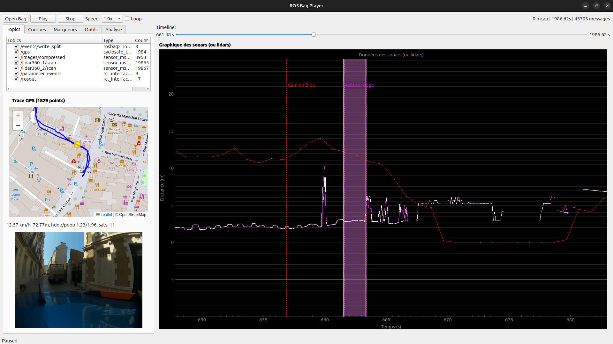

# cyclosafe_player

- [cyclosafe\_player](#cyclosafe_player)
	- [Fonctionnalités](#fonctionnalités)
- [Usage](#usage)
	- [Raccourcis claviers](#raccourcis-claviers)
- [Fonctionnement](#fonctionnement)
	- [Remarques](#remarques)
	- [Ouverture des rosbag](#ouverture-des-rosbag)
	- [Lecture et publication des données](#lecture-et-publication-des-données)
	- [Courbes](#courbes)
	- [Courbes pour les LiDARS](#courbes-pour-les-lidars)
	- [Marqueurs](#marqueurs)
		- [Dépassement et croisement](#dépassement-et-croisement)
		- [Pics de détection](#pics-de-détection)
	- [Détection des pics](#détection-des-pics)
		- [Visualisation des pics](#visualisation-des-pics)
	- [Import/export en CSV](#importexport-en-csv)
		- [Import depuis un CSV](#import-depuis-un-csv)
		- [Export vers un CSV](#export-vers-un-csv)
		- [Format](#format)
	- [Onglet analyses](#onglet-analyses)
	- [Pourquoi ne pas avoir utilisé `ros2 bag play` ou `rqt_bag` ?](#pourquoi-ne-pas-avoir-utilisé-ros2-bag-play-ou-rqt_bag-)
		- [`ros2 bag play`](#ros2-bag-play)
		- [`rqt_bag`](#rqt_bag)

## Fonctionnalités

Ce package python implémente une interface basée sur `Qt` permettant :
- d'ouvrir et de lire des [`rosbag`](../../ROS2.md#bag-ou-rosbag) avec `rosbag2_py`
- de contrôler la vitesse de lecture des données et d'avancer ou reculer dans le temps
- de visualiser les messages `sensor_msgs/msg/range` sur un graphique avec `pyqtgraph`
- de visualiser la moyenne des points d'un `sensor_msgs/msg/LaserScan` détectés dans un cône paramètrable
- fournit un outil pour annoter des **dépassements/croisements** (ou tout autre type d'évènement) dans les enregistrements via un système de **marqueurs** par **catégorie**.
  
  Ces marqueurs sont exportables/importables au format **json**.
- fournit un algorithme (très rudimentaire) de détection des "pics" sensés correspondre aux dépassements par un véhicule.
  
  Ces pics sont mis en évidence au fur et à mesure de la lecture.
- permet l'export ou l'import des données de type `sensor_msgs/msg/range` en **CSV** avec un format personnalisable.
- affiche en direct les images publiées sur `std_msgs/msg/CompressedImage`

# Usage

~~~
ros2 run cyclosafe_player player ~/data/import/20250522-091523/out/_0.mcap
~~~

> **Remarque** : Contrairement aux noeuds ROS classiques, `player` ne prend pas l'argument **ros-args** mais seulement un seul et unique argument `bag`.
>
> Ce bag peut-être compressé au format **.zstd**, auquel cas il sera décompressé de façon transparente à son ouverture.

## Raccourcis claviers

- → Avancer d'1s
- ← Reculer d'1s
- ↑ Augmenter la vitesse de lecture
- ↓ Diminuer la vitessee de lecture
- Espace : pause/reprendre

# Fonctionnement

## Remarques

Cet outil a été l'objet d'une multitude de modifications à mesure que les besoins ont évolué.

Il est très utile à l'analyse mais son architecture n'a pas été bien pensée dès le début, les outils étant trop imbriqués les uns dans les autres.

Ce document a pour but de présenter les différentes fonctionnalités et fera peu état des choix d'implémentations.

Ayant été développée au moment de nombreux tests basés sur les sonars, la section du code concernant l'analyse des pics mentionne **"sonar"** plutôt que **"range_sensor"**. Dans les faits les analyses effectuées s'appliquent également aux lidars, ou à tout noeud-capteur  publiant des messages de type `sensor_msgs/msg/Range`.

## Ouverture des rosbag

Le bag à ouvrir doit être au format **.mcap**.

S'il est compressé, il sera décompressé à l'ouverture de façon transparente dans le dossier `/tmp`.

A son ouverture, l'ensemble des topics qu'il contient sont récupérés et affichés dans l'onglet `Topics`.

Chaque topic coché sera republié en temps réel sur un topic du même nom.

A l'ouverture, si le bag contient des topics `sensor_msgs/msg/Range`, l'ensemble de ces messages vont être lus afin d'identifier les pics.

Les pics sont enregistrés dans des marqueurs d'une catégorie dédiée `/sensor/topic_name_peaks`.

L'algorithme peut-être relancé avec des paramètres personnalisés dans l'onglet `Outils`.

## Lecture et publication des données

Lorsque la lecture est activée, un nouveau temps virtuel (fonction de la vitesse de lecture) est calculé à un interval de 50ms. Tous les messages se trouvant sur le bag entre le dernier temps et le nouveau temps sont désérialisés et publiés.

La barre de temps peut-être ajustée manuellement avec la souris, ou les raccourcis claviers peuvet être utilisés pour se déplacer.

> Le délai de 50ms (ajustable) peut paraître élevé mais n'est pas réellement perceptible sur Rviz.
> 
> Pour la visualisation sur le graphique, les points sont placés en utilisant leur timestamp réel, donc il n'y a de perte de résolution.
> 
> En revanche, si par la suite des analyses sont faites à partir des messages publiés par `cyclosafe_player` et non lus directement dans le bag, ce délai devra être ajusté pour rendre compte d'une meilleure résolution temporelle. Cependant il est nettement préférable de lire les données directement dans le bag.

## Courbes

Via l'onglet `Courbes` peuvent afficher/masquer les courbes des distances publiées par les sonars et/ou les lidars.

Ces courbes peuvent être interrompues si le capteurs envoie des `NaN`, correspondant à une absence de mesure ou à une mesure incertaine.

Le facteur d'échelle de l'axe X et Y peut-être modifié en maintenant le clic droit de la souris enfoncé.

## Courbes pour les LiDARS

Etant donné que le prototype final n'inclue pas de sonars mais 2 lidars à 360° publiant des `sensor_msgs/msg/LaserScan`, il a été ajouté une fonction `emulateRange()` (dans [GraphWiget.py](./cyclosafe_player/src/GraphWidget.py)) permettant d'isoler certains points du LaserScan et de calculer pour ces points une distance moyenne permettant "d'émuler" le comportement d'un sonar orienté dans une certaine direction. 

Cela permet de mettre à profit les différents outils de `cyclosafe_player` sur les données envoyées par les lidars.

La plage de points à utiliser pour cette moyenne est définissable par topic au début du fichier [GraphWiget.py](./cyclosafe_player/src/GraphWidget.py):
~~~
# Update these values to configure which lidar points (all point between min and max radian) are
# averaged to simulate a Range sensor.
laser_scan_angles = {
	"/lidar360_1/scan" : {'min': -1.6, 'max': -1.55},
	"/lidar360_2/scan" : {'min': 1.55, 'max': 1.60},
}
~~~

## Marqueurs

Les marqueurs permettent d'annoter la timeline pour mettre en évidence des évènements particuliers.

Les marqueurs appartiennent à une **catégorie** à laquelle est associée une couleur.

A chaque marqueur est associé au moins :
- un timestamp unique : moment de l'évènement
- une description

Deux marqueurs d'une même catégorie ne peuvent avoir un timestamp strictement identique.

Les marqueurs sont exportables (et importables) au format **json**. A l'ouverture d'un bag, si le dossier contenant le bag (généralement `out/`) contient également un fichier `marker_export.json`, celui-ci sera automatiquement chargé. Il est donc conseillé d'enregistrer l'export dans le même dossier que le bag.

Il existe 3 catégories de marqueurs spéciales ayant des propriétés en plus :

### Dépassement et croisement

Catégories de marqueurs existantes par défaut et ayant des propriétés supplémentaires :
- distance de dépassement
- couleur du véhicule
- type de véhicule (voiture, camion, moto, vélo, ...)
- forme du nuage de points sur rviz (choix multiple qualitatif)

Ces marqueurs peuvent-être utilisés en compléments de l'outil d'[**import/export CSV**](#importexport-en-csv), afin d'identifier et quantifier pour chaque croisement/dépassement la présence (ou l'absence) de pics de détection sur les différents capteurs.

### Pics de détection

Produits par l'[**algorithme de détection des pics**](#détection-des-pics). Permettents de mettre en évidence et de repérer les différents pics.

Contient des propriétés supplémentaires sur la nature du pic :
- sa durée
- sa distance moyenne
- l'écart-type de la distance
- la distance min
- la distance max
- le nombre d'échantillons (de points/mesures) qu'il contient

## Détection des pics

Algorithme très rudimentaire permettant de détecter les moments où les distances publiées sur un topic de type `sensor_msgs/msg/Range` passent en dessous d'un certain seuil.

L'algorithme prend les paramètres suivants :

> `treshold_drop` : float
> - **Défaut** : 3.0
> - **Unit** : m
> - seuil en dessous duquel une distance est considérée comme un pic valide

> `min_duration_sec` : float
> - **Défaut** : 0.3
> - **Unit** : s
> - durée minimal d'un pic pour qu'il soit valide (c'est à dire la durée pendant laquelle `distance < treshold_drop`)

> `recovery_tolerance` : float
> - **Défaut** : 0.3
> - **Unit** : s
> - durée pendant laquelle la distance peut brièvement repasser au dessus de la valeur seuil pendant un pic, sans que celui-ci soit considéré comme interrompu. Destiné à limiter l'influence du bruit sur un pic.

L'algorithme est lancé automatiquement avec les paramètres par défaut à l'ouverture d'un bag.

Il peut être relancé avec des paramètres personnalisés dans l'onglet `Outils`.

Des marqueurs sont créés pour chaque pic détecté dans une catégorie dédiée.

### Visualisation des pics

Par défaut, les pics sont automatiquement mis en évidence au fur et à mesure de la lecture, afin de tout de suite identifier les vrais positifs lors d'un dépassement. 

Cette option est désactivable par topic dans l'onglet `Analyses`.

## Import/export en CSV

Outil permettant l'export ou l'import des données au format CSV, et la mise en corrélation des croisements/dépassements avec les pics détectés.

### Import depuis un CSV

Dans le cadre d'un import, le but est surtout de générer automatiquement les marqueurs dépassements/croisements à partir de timestamp et des informations liées au véhicule dans un CSV.

### Export vers un CSV

Chaque croisement et dépassement est considéré comme un évènement d'intérêt et exporter sous forme ligne.

Pour chaque croisement/dépassement (pour chaque ligne) sont identifiées et ajoutées des informations sur la présence/absence de pics pour chacun des topics `sensor_msgs/msg/Range`.

Les données à exporter et leur format sont personnalisables.

> **Remarque** : En l'état le nom des catégories de marqueurs à exporter est figé à `sonarN_peaks`. Pour l'utiliser avec des lidars il faudrait revoir la façon dont ces catégories sont créées.

### Format

Le champ format définit la structure et les champs du CSV à importer ou exporter.

<ins>**Exemple**</ins> :

`0$bag=bag,
1$time=temps,
3$vehicle=type de véhicule,
4$color=couleur,
5$type=direction,
7$shape=forme,
8$distance=distance,
28$sonar1.mean=sonar1 mean distance,
29$sonar1.std_dev=sonar1 std dev,
30$sonar1.min=sonar1 min,
31$sonar1.sample_count=sonar1 sample count,
32$sonar1.duration=sonar1 duration,
33$sonar1.delta=sonar1 delta`
- `0` : facultatif, précise l'indice de la colonne correspondante. Peut-être omis, auquel cas l'index est défini au précédent index + 1.
- `$bag` : donnée à laquelle correspond la colonne. Les types valides sont :
  - `$bag` : nom du bag
  - `$time` : timestamp de l'évènement (relatif au début de l'enregistrement)
  - `$vehicle` : type de de véhicule (voiture, moto, bus, etc...)
  - `$color` : couleur du véhicule
  - `$type` : direction de l'évènement ("Dépassement" ou "Croisement")
  - `$shape` : forme du nuages de points sur le lidar 360°
  - `$distance` : distance de dépassement
  - `$[sensor_name].mean` : si présence d'un pic, distance moyenne du pic
  - `$[sensor_name].std_dev` : si présence d'un pic, écart-type du pic
  - `$[sensor_name].min` : si présence d'un pic, distance minimale du pic
  - `$[sensor_name].max` : si présence d'un pic, distance maximale du pic
  - `$[sensor_name].duration` : si présence d'un pic, durée du pic
  - `$[sensor_name].sample_count` : si présence d'un pic, nombre d'échantillons (de mesures) que contient le pic.
  - `$[sensor_name].delta` : si présence d'un pic, différence entre la distance de l'évènement avec la distance moyenne mesurée par le pic.
- `=bag` : facultatif, entête de la colonne dans le fichier de sortie. Si omise, sera égale au nom de la donnée correspondante.
- `,` : séparateur entre deux colonnes
- Le format est insensible aux sauts de ligne et aux espaces.

Deux champs (colonnes) sont séparés par une virgule (`,`).

## Onglet analyses

Permet d'activer/désactiver la mise en évidence des pics pour chacun des topics `sensor_msgs/msg/Range`.

Affiche également des détails sur les pics présents à l'instant T de la lecture.

## Pourquoi ne pas avoir utilisé `ros2 bag play` ou `rqt_bag` ?

**ROS2** fournit déjà deux outils permettant de lire des rosbag :

### `ros2 bag play`

Il s'agit d'un outil sur terminal permettant de lire des rosbag tout en contrôlant la vitesse de lecture.

Etant sur terminal, il est peu interactif.

Par ailleurs il ne permet pas de revenir en ou de naviguer d'un moment à l'autre dans le bag.

### `rqt_bag`

Interface graphique permettant de lire des **rosbag** et de visualiser les images le long d'une timeline.

Malheureusement le package ne semble pas avoir été mis à jour pour fonctionner correctement avec `Jazzy` et génère de nombreusees erreurs liées à des `QoS` (Quality of Service) incompatibles.

Egalement il ne gère pas bien l'affichage des images compressées. 