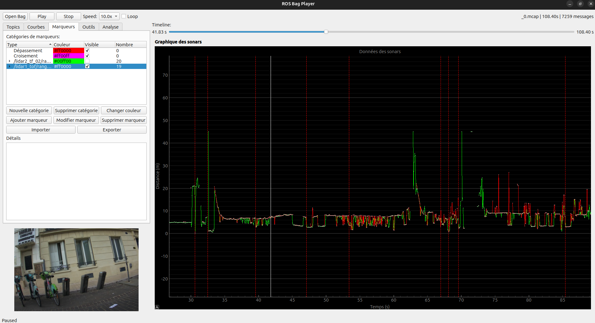

# cyclosafe_player

- [cyclosafe\_player](#cyclosafe_player)
	- [Fonctionnalités](#fonctionnalités)
- [Usage](#usage)
	- [Raccourcis claviers](#raccourcis-claviers)
- [Fonctionnement](#fonctionnement)
	- [Remarques](#remarques)
	- [Ouverture des rosbag](#ouverture-des-rosbag)
	- [Lecture et publication des données](#lecture-et-publication-des-données)
	- [Courbes](#courbes)
	- [Marqueurs](#marqueurs)
		- [Dépassement et croisement](#dépassement-et-croisement)
		- [Pics de détection](#pics-de-détection)
	- [Détection des pics](#détection-des-pics)
	- [Import/export en CSV](#importexport-en-csv)
	- [Onglet analyses](#onglet-analyses)
	- [Pourquoi ne pas avoir utilisé `ros2 bag play` ou `rqt_bag` ?](#pourquoi-ne-pas-avoir-utilisé-ros2-bag-play-ou-rqt_bag-)
		- [`ros2 bag play`](#ros2-bag-play)
		- [`rqt_bag`](#rqt_bag)

## Fonctionnalités

Ce package python implémente une interface basée sur `Qt` permettant :
- d'ouvrir et de lire des [`rosbag`](../../ROS2.md#bag-ou-rosbag) avec `rosbag2_py`
- de contrôler la vitesse de lecture des données et d'avancer ou reculer dans le temps
- de visualiser les messages `sensor_msgs/msg/range` sur un graphique avec `pyqtgraph`
- fournit un outil pour annoter des **dépassements/croisements** (ou tout autre type d'évènement) dans les enregistrements via un système de **marqueurs** par **catégorie**.
  
  Ces marqueurs sont exportables/importables au format **json**.
- fournit un algorithme (très rudimentaire) de détection des "pics" sensés correspondre aux dépassements par un véhicule.
  
  Ces pics sont mis en évidence au fur et à mesure de la lecture.
- permet l'export ou l'import des données de type `sensor_msgs/msg/range` en **CSV** avec un format personnalisable.
- affiche en direct les images publiées sur `std_msgs/msg/CompressedImage`

# Usage

~~~
ros2 run cyclosafe_player player ~/data/import/20250522-091523/out/_0.mcap
~~~

> **Remarque** : Contrairement aux noeuds ROS classiques, `player` ne prend pas l'argument **ros-args** mais seulement un seul et unique argument `bag`.
>
> Ce bag peut-être compressé au format **.zstd**, auquel cas il sera décompressé de façon transparente à son ouverture.

## Raccourcis claviers

- → Avancer d'1s
- ← Reculer d'1s
- ↑ Augmenter la vitesse de lecture
- ↓ Diminuer la vitessee de lecture
- Espace : pause/reprendre

# Fonctionnement

## Remarques

Cet outil a été l'objet d'une multitude de modifications à mesure que les besoins ont évolué.

Il est très utile à l'analyse mais son architecture n'a pas été bien pensée dès le début, les outils étant trop imbriqués les uns dans les autres.

Ce document a pour but de présenter les différentes fonctionnalités et fera peu état des choix d'implémentations.

## Ouverture des rosbag

Le bag à ouvrir doit être au format **.mcap**.

S'il est compressé, il sera décompressé à l'ouverture de façon transparente dans le dossier `/tmp`.

A son ouverture, l'ensemble des topics qu'il contient sont récupérés et affichés dans l'onglet `Topics`.

Chaque topic coché sera republié en temps réel sur un topic du même nom.

A l'ouverture, si le bag contient des topics `sensor_msgs/msg/Range`, l'ensemble de ces messages vont être lus afin d'identifier les pics.

Les pics sont enregistrés dans des marqueurs d'une catégorie dédiée `/sensor/topic_name_peaks`.

L'algorithme peut-être relancé avec des paramètres personnalisés dans l'onglet `Outils`.

## Lecture et publication des données

Lorsque la lecture est activée, un nouveau temps virtuel (fonction de la vitesse de lecture) est calculé à un interval de 50ms. Tous les messages se trouvant sur le bag entre le dernier temps et le nouveau temps sont désérialisés et publiés.

La barre de temps peut-être ajustée manuellement avec la souris, ou les raccourcis claviers peuvet être utilisés pour se déplacer.

> Le délai de 50ms (ajustable) peut paraître élevé mais n'est pas réellement perceptible sur Rviz.
> 
> Pour la visualisation sur le graphique, les points sont placés en utilisant leur timestamp réel, donc il n'y a de perte de résolution.
> 
> En revanche, si par la suite des analyses sont faites à partir des messages publiés par `cyclosafe_player` et non lus directement dans le bag, ce délai devra être ajusté pour rendre compte d'une meilleure résolution temporelle. Cependant il est nettement préférable de lire les données directement dans le bag.

## Courbes

Via l'onglet `Courbes` peuvent afficher/masquer les courbes des distances publiées par les sonars et/ou les lidars.

Ces courbes peuvent être interrompues si le capteurs envoie des `NaN`, correspondant à une absence de mesure ou à une mesure incertaine.

Le facteur d'échelle de l'axe X et Y peut-être modifié en maintenant le clic droit de la souris enfoncé.

## Marqueurs

Les marqueurs permettent d'annoter la timeline pour mettre en évidence des évènements particuliers.

Les marqueurs appartiennent à une **catégorie** à laquelle est associée une couleur.

A chaque marqueur est associé au moins :
- un timestamp unique : moment de l'évènement
- une description

Deux marqueurs d'une même catégorie ne peuvent avoir un timestamp strictement identique.

Les marqueurs sont exportables (et importables) au format **json**. A l'ouverture d'un bag, si le dossier contenant le bag (généralement `out/`) contient également un fichier `marker_export.json`, celui-ci sera automatiquement chargé. Il est donc conseillé d'enregistrer l'export dans le même dossier que le bag.

Il existe 3 catégories de marqueurs spéciales ayant des propriétés en plus :

### Dépassement et croisement

Catégories de marqueurs existantes par défaut et ayant des propriétés supplémentaires :
- distance de dépassement
- couleur du véhicule
- type de véhicule (voiture, camion, moto, vélo, ...)
- forme du nuage de points sur rviz (choix multiple qualitatif)

Ces marqueurs peuvent-être utilisés en compléments de l'outil d'[**import/export CSV**](#importexport-en-csv), afin d'identifier et quantifier pour chaque croisement/dépassement la présence (ou l'absence) de pics de détection sur les différents capteurs.

### Pics de détection

Produits par l'[**algorithme de détection des pics**](#détection-des-pics). Permettents de mettre en évidence et de repérer les différents pics.

Contient des propriétés supplémentaires sur la nature du pic :
- sa durée
- sa distance moyenne
- l'écart-type de la distance
- la distance min
- la distance max
- le nombre d'échantillons (de points/mesures) qu'il contient

## Détection des pics

WIP

## Import/export en CSV

WIP

## Onglet analyses

## Pourquoi ne pas avoir utilisé `ros2 bag play` ou `rqt_bag` ?

**ROS2** fournit déjà deux outils permettant de lire des rosbag :

### `ros2 bag play`

Il s'agit d'un outil sur terminal permettant de lire des rosbag tout en contrôlant la vitesse de lecture.

Etant sur terminal, il est peu interactif.

Par ailleurs il ne permet pas de revenir en ou de naviguer d'un moment à l'autre dans le bag.

### `rqt_bag`

Interface graphique permettant de lire des **rosbag** et de visualiser les images le long d'une timeline.

Malheureusement le package ne semble pas avoir été mis à jour pour fonctionner correctement avec `Jazzy` et génère de nombreusees erreurs liées à des `QoS` (Quality of Service) incompatibles.

Egalement il ne gère pas bien l'affichage des images compressées. 