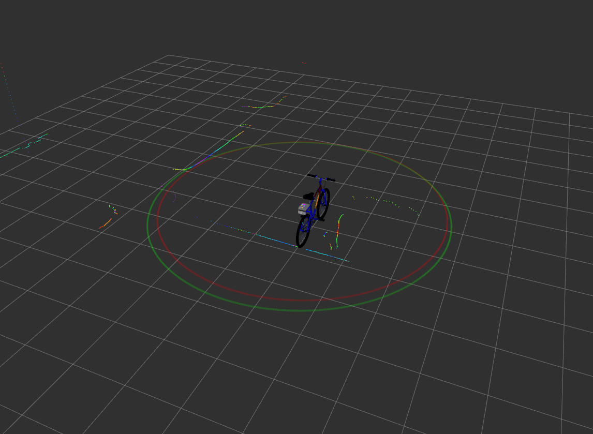
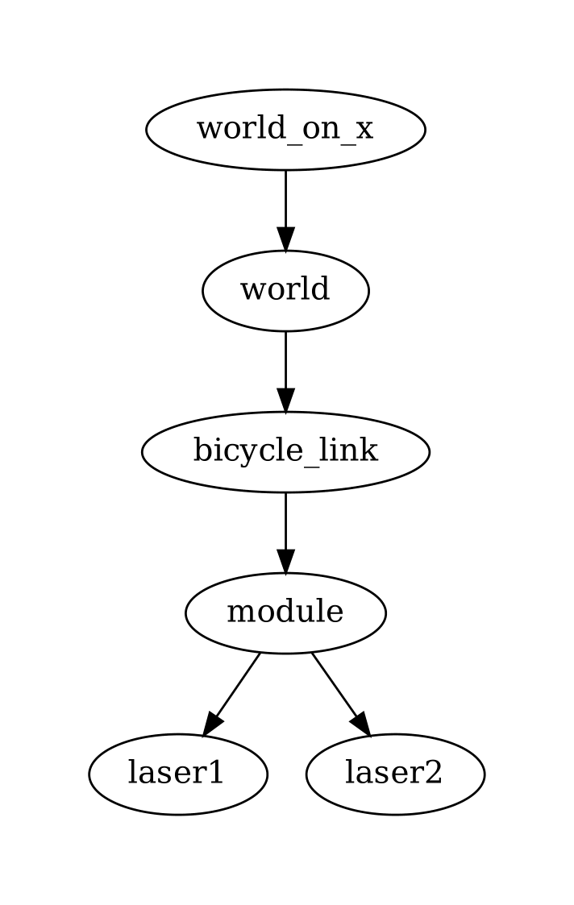

# cyclosafe_viewer

Package python implémentant plusieurs choses

- la launch description [**viewer.launch.py**](#) permettant de lancer simultanément tous les outils de visualisation à partir de données en directes ou d'un [`rosbag`](../../ROS2.md#bag-ou-rosbag) à revisionner.
- des noeuds ROS destinés à tourner pendant la visualisation des données :
  - [**gps_converter.py**](#) : noeud permettant la conversion de `cyclosafe_interfaces/msg/NavSatInfo` en `sensor_msgs/msg/NavSatFix`.
  - [**range_circle_transform.py**](#) : génère des cercles à partir de `geometry_msgs/msg/Point` pour représenter les `sensor_msgs/msg/Range` publiées.
- une description [`URDF`](../../ROS2.md#urdf---unified-robot-description-format) incluant les modèles 3D du vélo et des capteurs et permettant de définir les transformations à effectuer entre les différentes [`frames`](../../ROS2.md#frame---repère).

# viewer.launch.py

## Usage

Pour visualiser un bag :

~~~
ros2 launch cyclosafe_viewer viewer.launch.py bag:=~/data/import/20250522-093910/out/_0.mcap
~~~

Pour visualier les données en directe :

~~~
ros2 launch cyclosafe_viewer viewer.launch.py
~~~
Suppose que le raspberry est allumé et connecté via un cable ethernet.

> Aucune configuration réseau particulière n'est nécessaire. ROS2 publie par défaut ses messages sur le réseau.

## Fonctionnement

Cette launch description peut-être considérée comme le pendant pour la visualisation de la launch description [**cyclosafe.launch.py**](../../../core/src/cyclosafe/README.md#launch-description).

Voir la documentation associée aux launch descriptions sur ROS2 :

https://docs.ros.org/en/foxy/Tutorials/Intermediate/Launch/Creating-Launch-Files.html

Ou : https://roboticsbackend.com/ros2-launch-file-example/

Cette launch description :
- ouvre une fenêtre `Rviz`
- lit la configuration [**config.py**](launch/config.py) (ou celle donnée par le paramètre `config`) pour en extraire `sensors_list`. C'est une liste de [**Sensor**](../../../core/src/cyclosafe_config/README.md#classe-sensor) déclarant les propriétés de chacun des capteurs à représenter
- lance un noeud [**range_circle_transform**](#) pour représenter les distances envoyées par les sonars ou les lidars de la config. La couleur des [**Sensor**](../../../core/src/cyclosafe_config/README.md#classe-sensor) définit dans [**config.py**](launch/config.py) sont transmises au noeud.
- pour chaque [**Sensor**](../../../core/src/cyclosafe_config/README.md#classe-sensor) de la config qui nécessite une transformation : lance un [`static_transform_publisher`](../../ROS2.md#tf2)
- lance un [`static_transform_publisher`](../../ROS2.md#tf2) pour effectuer une transformation de la frame racine URDF `bicycle_link` vers la frame `world`
- lance un [`static_transform_publisher`](../../ROS2.md#tf2) pour effectuer une transformation de la frame `world` vers la frame `world_on_x` afin de permettre la visualisation la scène dans une vue orthogonale sur l'axe X (la seule vue orthogonale disponible sur Rviz étant sur l'axe Z).
- lance un [`robot_state_publisher`](../../ROS2.md#urdf---unified-robot-description-format) à partir de la description URDF pour générer l'arbre de transformation pour les différentes capteurs et modèles 3D.

Et en fonction des paramètres :

- si le paramètre `bag` est renseigné : lance une fenêtre `cyclosafe_player`
- si le paramètre `bag` n'est pas renseigné : ouvre une fenêtre `rqt_image_view` pour visualiser les images en direct
- si le paramètre `map` est activé : lance [**rviz_satellite**](../rviz_satellite/README.md), [**gps_converter.py**](#) pour convertir les messages gps dans le format attendu par rviz_satellite et un [`static_transform_publisher`](../../ROS2.md#tf2) pour transformer la frame world vers la frame map.

## Paramètres

> **config** : str
> - défaut: **""**
> - précise un chemin vers une config personnalisée à lancer
> - par défaut, utilise le fichier **config.py** situé dans le même dossier que la launch description.

> **bag** : str
> - défaut: **""**
> - précise le chemin vers un rosbag à partir duquel les données seront jouables via une fenêtre de `cyclosafe_player`.
>
> 	Accepte les bag au format **.mcap** ou compressé au format **.mcap.zstd** (le bag sera décompressé à l'ouverture).

> **map** : boolean
> - défaut: **"false"**
> - si `true`, un noeud [**rviz_satellite**](../rviz_satellite/README.md) sera lancé et une tuile d'une vue satellite *openstreeview* sera mappée à partir des positions GPS publiées.

## Spécificités

La structure de [**viewer.launch.py**](launch/viewer.launch.py) n'est pas tout à fait standard dans la mesure où :
- Elle repose lourdement sur la déclaration préalable d'une liste globale de [**Sensor**](../cyclosafe_config/README.md#classe-sensor) importée depuis un fichier extérieur ([**config.py**](launch/config.py)).
  
  L'avantage est de centraliser tout ce qui peut varier d'un test à l'autre sur un seul fichier. On peut par exemple avoir un fichier **config1.py** et **config2.py** qui correspond à un certain prototype avec des capteurs spécifiques ou des paramètres différents.
  
  Si on veut ensuite visualiser les données prises par la **config1** et celle par la **config2**, on peut le faire simplement en précisant à **cyclosafe_viewer** la config adéquate.

- Elle utilise une **fonction opaque** pour résoudre la description au runtime.

  En effet l'essentiel de la description dépend des paramètres donnés ou du contenu du fichier [**config.py**](launch/config.py). Or une launch description correspondant en quelque sorte à une recette de lancement qui n'est pas paramètrable directement.

  L'utilisation de **OpaqueFunction()** permet de déclarer une fonction qui sera executé avec le contexte du runtime avant de de renvoyer la description définitive.

### Résumé des étapes de lancement

1. **Execution de la fonction opaque launch_setup()** avec le contexte (cad. les arguments transmis avec la commande **ros2 launch cyclosafe_viewer viewer.launch.py [...args])**
2. **Résolution des arguments**
3. **Ajout des différents noeuds selon les options activées** (voir [**fonctionnement**](#fonctionnement))
4. La description finale est renvoyée pour être lancée

# Noeuds

## gps_converter.py

Les outils cartographiques comme [**rviz_satellite**](../rviz_satellite/README.md) ou [**mapviz**](../mapviz/README.md) attendent de recevoir des `sensor_msgs/msg/NavSatFix`

Les messages publiés par le [**noeud gps**](../../../core/src/cyclosafe/README.md#gpspy) étant de type `cyclosafe_interfaces/msg/NavSatInfo`, il est donc nécessaire de les convertir.

Peut également permettre de générer un fichier gpx à la sortie, mais cette fonction a été supplantée par le script [**gpx_exporter**](../../../scripts/README.md#gpx_exporterpy), plus efficace et adapté dans la meesure ou gps_converter.py écrit les traces au fur et à mesure de la lecture dans un fichier.

### Usage

~~~
ros2 run cyclosafe_viewer gps_converter --ros-args -p topic_src:=/gps -p topic:=/nav_fix
~~~

Reçoit les messages publiés sur le topic `/gps`, les convertit en `sensor_msgs/msg/NavSatFix` et les publie sur le topic `/nav_fix`.

### Paramètres

> **topic_src** : str
> - défaut: **"/gps"**
> - topic sur lequel des `cyclosafe_interfaces/msg/NavSatInfo` sont publiés auquel souscrire

> **topic** : str
> - défaut: **"/nav_fix"**
> - topic sur lequel publier des `sensor_msgs/msg/NavSatFix` 

> **gpx_enabled** : boolean
> - défaut: **False**
> - Active/désactive l'enregistrement en direct des traces gpx dans un fichier

> **gpx_file_path** : str
> - défaut: **""**
> - détermine le chemin de sortie pour la trace gpx si l'option d'enregistrement est activée

> **gpx_track_name** : str
> - défaut: **"ROS2 GPS Track"**
> - Détermine comment nommer la trace dans le fichier GPX.

# Modèle URDF

Format XML standardisé pour décrire la structure physique d'un robot, incluant ses liens (links), articulations (joints), propriétés visuelles et de collision.

**viewer.launch.py** utilise un modèle URDF pour positionner dans l'espace les modèles 3D du vélo et des capteurs, et pour définir les transformations à effectuer pour replacer les données dans l'espace.

Fonctionne avec le [package](#package) `robot_state_publisher` qui prend en entrée une description [URDF](#urdf---unified-robot-description-format) et génère automatiquement l'arbre de transformation [`tf2`](#tf2) associé.

## Arbre de transformation des frames
 

La frame racine du modèle URDF est le `bicycle_link`.

Toutes les transformations vers les frames enfants à partir de `bicycle_link` sont gérées par `robot_state_publisher`.

Les transformations de `bicycle_link` vers `world` et `world_link` sont gérées par un `static_transform_publisher`.

Les dernières frames enfants (**ex**: `lidar1_tof/range` ou `laser1`) sont les frames dans lesquelles les données sont publiées par les noeuds-capteurs.